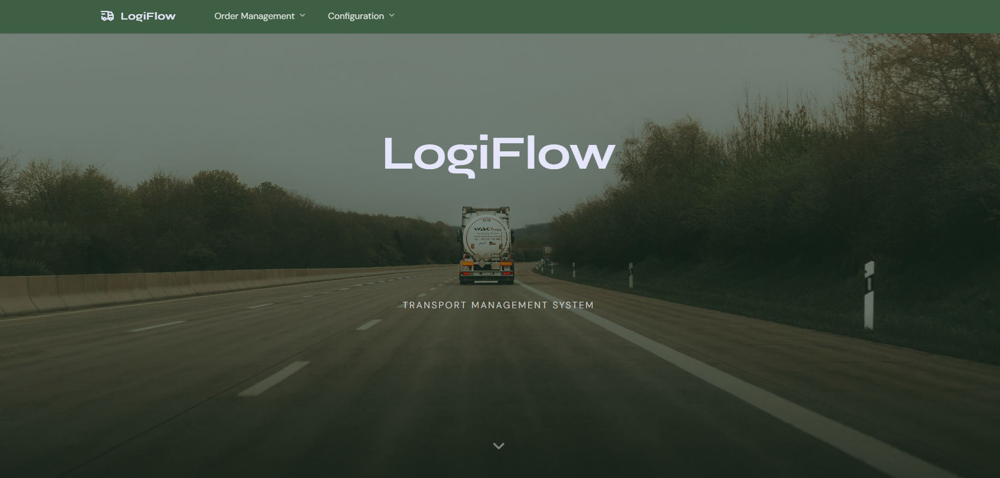
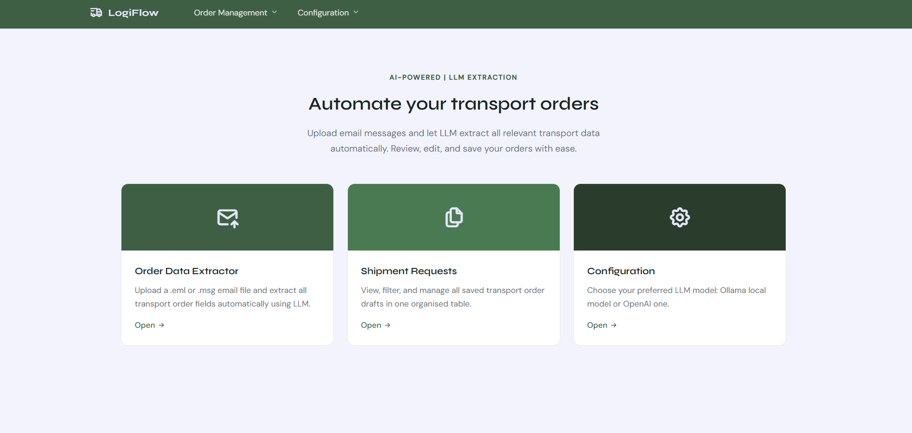
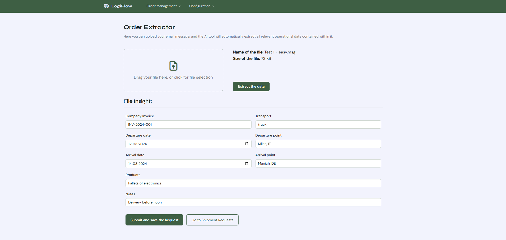
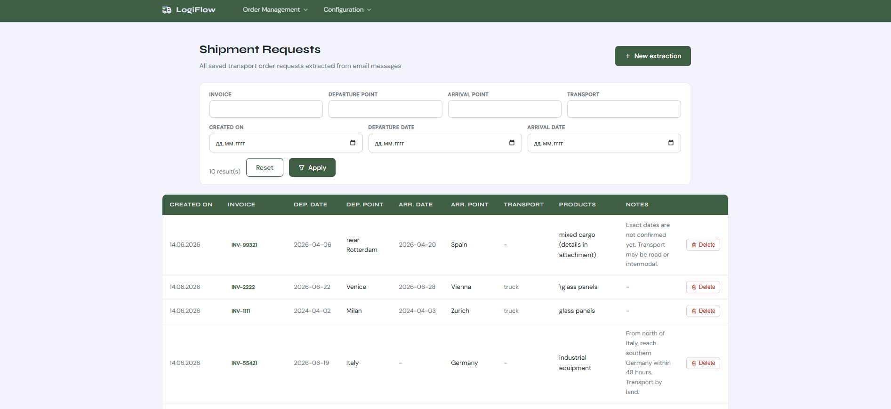
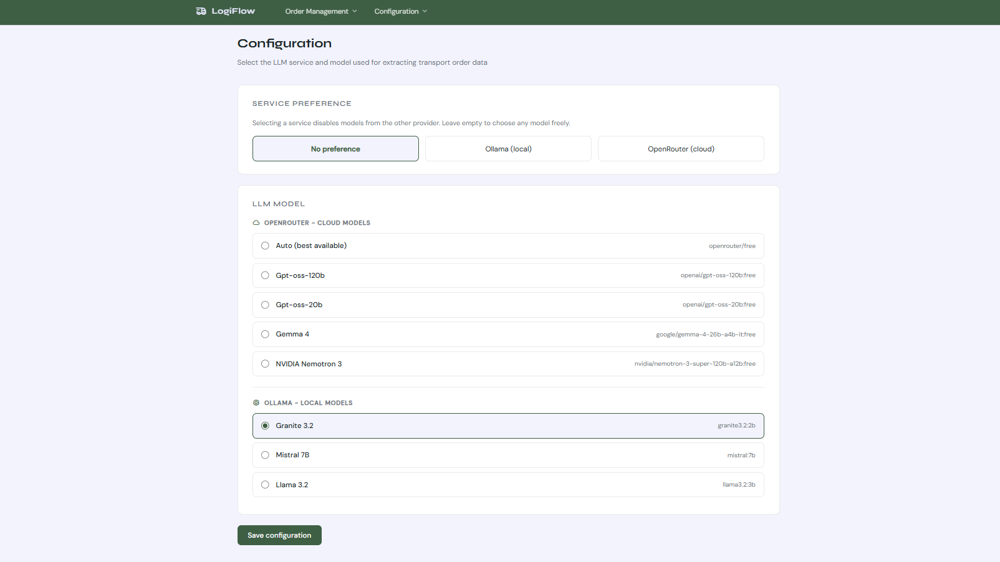

# LogiFlow - TMS Order Extraction Module

A portfolio project demonstrating an AI-powered transport order extraction system.

The module introduces a language-model-driven interpretation layer that extracts structured transport attributes from unstructured email messages and generates validated draft records prior to official system registration

Users upload email files (`.eml` / `.msg`), and the system uses an LLM to automatically extract 8 structured order fields and save them to a cloud database.

---

## Key Features

- **Drag-and-drop upload** of Gmail `.eml` and Outlook `.msg` email files
- **LLM extraction** of 8 structured transport order fields from - **Two LLM providers**: OpenRouter (cloud, free tier) and Ollama (local, offline)raw email text
- **Editable form** to review and correct extracted data before saving
- **RavenDB Cloud** persistence with server-side filtering across 7 fields
- **Responsive table** with horizontal scroll for Shipment Requests (saved transport data)
- **Configuration page** to switch between models without redeployment

---

## Project Structure

- `OrderModule.Web` - ASP.NET Core MVC web application: controllers, views, models
- `OrderModule.Application` - Business logic: LLM services, extraction, persistence
- `OrderModule.RavenDB` - Database indexes and DocumentStore initialization

-> Full architecture details (layer responsibilities, request flow and solution structure): [docs/ARCHITECTURE.md](docs/ARCHITECTURE.md)

---

## Tech Stack

| Layer | Technology |
|---|---|
| Backend | C#, ASP.NET Core 8, MVC |
| Frontend | Vue 2 (via CDN), Razor (.cshtml) |
| Database | RavenDB Cloud (free tier) |
| Cloud LLM | OpenRouter API (free tier) |
| Local LLM | Ollama |
| Email parsing | MsgReader |

---

## UI Overview

### Home Page

### Order Extractor - upload email file and extract the data

### Shipment Requests - saved orders table with filters

### Configuration - select LLM model to run

---

## Available LLM Models

**OpenRouter (cloud):**
- `openrouter/free`
- `openai/gpt-oss-120b:free`
- `openai/gpt-oss-20b:free`
- `google/gemma-4-26b-a4b-it:free`
- `nvidia/nemotron-3-super-120b-a12b:free`

**Ollama (local):**
- `mistral:7b`
- `llama3.2:3b`
- `granite3.2:2b`

-> More about chosen LLM models: [docs/LLM_MODELS.md](docs/LLM_MODELS.md)

---
